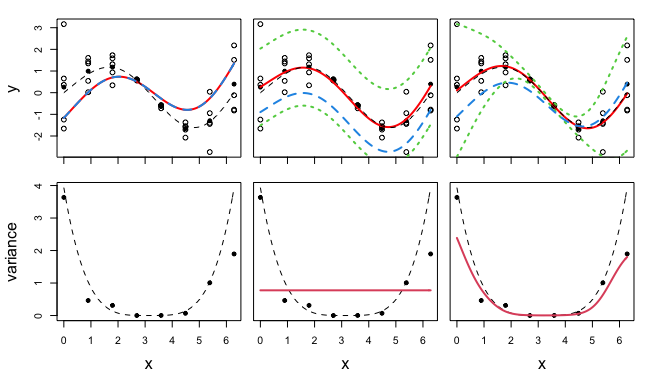

Calibration of inexact computer models with heteroscedastic errors
(Reproducibility)
================
Chih-Li Sung
October 11, 2022

This instruction aims to reproduce the results in the paper
“*Calibration of Inexact Computer Models with Heteroscedastic Errors*”
by [Sung, Barber, and Walker (2023+)](https://arxiv.org/abs/1910.11518)
in SIAM/ASA Journal on Uncertainty Quantification.

The code folder reproduces the results in the Sections 4 and 5 of the
manuscript.

-   The required R packages include `SLHD (>=2.1-1)` and
    `devtools (>=2.4.3)`, and the package `HetCalibrate` that was
    developed by the author Chih-Li Sung. The installation will be
    demonstrated.

The `data` folder contains the required data:

-   `PLGG_growthdata_ambientCO2.csv`: The plant growth data under
    ambient CO2 concentrations
-   `PLGG_growthdata_hiCO2.csv`: The plant growth data under high CO2
    concentrations

The reproducibility is demonstrated as follows.

##### Step 0.1: install the package HetCalibrate

``` r
library(devtools)
install_github("ChihLi/HetCalibrate")
```

    ## 
    ## * checking for file ‘/private/var/folders/d1/cng8v70j0k33y9_6p7w5w_bc0000gr/T/RtmplvsFZU/remotes817268e6c665/ChihLi-HetCalibrate-1fa18db/DESCRIPTION’ ... OK
    ## * preparing ‘HetCalibrate’:
    ## * checking DESCRIPTION meta-information ... OK
    ## * checking for LF line-endings in source and make files and shell scripts
    ## * checking for empty or unneeded directories
    ## Omitted ‘LazyData’ from DESCRIPTION
    ## * building ‘HetCalibrate_0.1.tar.gz’

##### Step 0.2: load required package

``` r
library(HetCalibrate)
library(SLHD)
```

## Reproducing Section 4.1: Figure 1

``` r
### setting ###
n.timestep <- 8
n.rep.each <- 5

# computer model
f.sim <- function(x, cpara) {
  return(c(exp(x/10)*sin(x) - sqrt(cpara^2 - cpara + 1) * (sin(cpara*x)+cos(cpara*x))))
}
df.sim <- function(x, cpara) {
  return(c(-sqrt(cpara^2-cpara+1)*(x*cos(x*cpara)-x*sin(x*cpara))-((2*cpara-1)*(sin(x*cpara)+cos(x*cpara)))/(2*sqrt(cpara^2-cpara+1))))
}

# variance process
var.f <- function(x) (0.01+0.2*(x-pi)^2)^2

# physical process
p.fun <- function(x) exp(x/10)*sin(x)

# true parameter
true.cpara <- optim(0, fn = function(g) {
  x.grid <- seq(0,2*pi,0.01)
  mean((p.fun(x.grid) - f.sim(x.grid, g))^2)
}, 
lower = -0.3, upper = 0.3, method = "L-BFGS-B")$par


# observed input
X0 <- seq(0,2*pi,length.out = n.timestep)
# mean process
pmean <- p.fun(X0)
# variance process
var.y <- var.f(X0)
# number of replicates
n.rep <- rep(n.rep.each,length(X0))

# setting for lower and upper bounds of parameters
lower <- 0.01*max(X0)
upper <- 2.5*max(X0)
cpara_min <- -0.3  
cpara_max <- 0.3
cpara_init.vt <- c(-0.2, 0, 0.2)


### plot one example 
set.seed(1)

# simulate X and Z
X <- matrix(rep(X0, n.rep), ncol = 1)
Z <- rep(0, sum(n.rep))
for(i in 1:length(X0)) {
  Z[(ifelse(i==1,0,sum(n.rep[1:(i-1)]))+1):sum(n.rep[1:i])] <- pmean[i] + rnorm(n.rep[i], 0, sd = sqrt(var.y[i]))
}

## WLS
X0 <- hetGP::find_reps(X, Z)$X0
Z0 <- hetGP::find_reps(X, Z)$Z0
Sigma_inv <- diag(1/sapply(hetGP::find_reps(X, Z)$Zlist, var))
min.index <- which.min(apply(matrix(seq(cpara_min, cpara_max, length.out = 11),ncol=1), 1, function(x) optim(x, fn = function(g) t(Z0 - f.sim(X0, g)) %*% Sigma_inv %*% (Z0 - f.sim(X0, g)), 
                                                                                                             lower = cpara_min, upper = cpara_max, method = "L-BFGS-B")$value))

cpara.WLS <- optim(seq(cpara_min, cpara_max, length.out = 11)[min.index], 
                   fn = function(g) t(Z0 - f.sim(X0, g)) %*% Sigma_inv %*% (Z0 - f.sim(X0, g)), 
                   lower = cpara_min, upper = cpara_max, method = "L-BFGS-B")$par
xgrid <- matrix(seq(min(X0), max(X0), length.out = 101), ncol = 1) 
predictions.WLS <- f.sim(xgrid, cpara.WLS)
cat("============= WLS parameter:", cpara.WLS, "=============\n")
```

    ## ============= WLS parameter: -0.278369 =============

``` r
## KO
model <- vector("list", 3)
jj <- 0
for(cpara.init in cpara_init.vt){
  jj <- jj + 1
  model[[jj]] <- mleHomCalibrate(X = X, Z = Z, cpara_max = cpara_max, cpara_min = cpara_min,
                                 lower = lower, upper = upper,
                                 init = list("cpara" = cpara.init),
                                 covtype = "Matern5_2", orthogonal = FALSE, f.sim = f.sim, df.sim = df.sim)
}

llmax.index <- which.max(sapply(model, function(x) x$ll))
model <- model[[llmax.index]]
cpara.Hom <- model$cpara
predictions.Hom <- predict(x = xgrid, object =  model)
cat("============= HomGP parameter:", cpara.Hom, "=============\n")
```

    ## ============= HomGP parameter: 0.2673526 =============

``` r
## our model
model <- vector("list", 3)
jj <- 0
for(cpara.init in cpara_init.vt){
  jj <- jj + 1
  model[[jj]] <- mleHetCalibrate(X = X, Z = Z, cpara_max = cpara_max, cpara_min = cpara_min,
                                 lower = lower, upper = upper,
                                 init = list("cpara" = cpara.init),
                                 settings = list(checkHom = FALSE, linkThetas = "none"),
                                 covtype = "Matern5_2", orthogonal = TRUE, f.sim = f.sim, df.sim = df.sim)
  
}
llmax.index <- which.max(sapply(model, function(x) x$ll))
model <- model[[llmax.index]]
cpara.Het.OGP <- model$cpara
predictions.Het <- predict(x = xgrid, object =  model)
cat("============= HetOGP parameter:", cpara.Het.OGP, "=============\n")
```

    ## ============= HetOGP parameter: -0.1727379 =============

``` r
par(mfrow=c(2,3), oma=c(4.5, 4, 0, 2.5), mar=c(0.5,0.5,1.5,0.5))
## mean process
# WLS
plot(X, Z, ylab = 'y', xlab = "", xaxt="n")
mtext("y", 2, 3, las = 0)
axis(1, seq(0,6,1), labels = rep("", 7))
points(X0, Z0, pch = 20, cex = 1.2)
lines(xgrid, predictions.WLS, col = 'red', lwd = 2)
curve(p.fun, min(X0), max(X0), add = TRUE, col = 1, lty = 2, lwd = 1)
lines(xgrid, f.sim(xgrid, cpara.WLS), col = 4, lty = 2, lwd = 2)

# KO
plot(X, Z, ylab = 'y', xlab = "", xaxt="n", yaxt="n")
axis(1, seq(0,6,1), labels = rep("", 7))
points(X0, Z0, pch = 20, cex = 1.2)
lines(xgrid, predictions.Hom$mean, col = 'red', lwd = 2)
curve(p.fun, min(X0), max(X0), add = TRUE, col = 1, lty = 2, lwd = 1)
lines(xgrid, qnorm(0.025, predictions.Hom$mean, sqrt(predictions.Hom$sd2 + predictions.Hom$nugs)), 
      col = 3, lty = 3, lwd = 2)
lines(xgrid, qnorm(0.975, predictions.Hom$mean, sqrt(predictions.Hom$sd2 + predictions.Hom$nugs)), 
      col = 3, lty = 3, lwd = 2)
lines(xgrid, f.sim(xgrid, cpara.Hom), col = 4, lty = 2, lwd = 2)

# our model
plot(X, Z, ylab = 'y', xlab = "", xaxt="n", yaxt="n")
axis(1, seq(0,6,1), labels = rep("", 7))
points(X0, Z0, pch = 20, cex = 1.2)
lines(xgrid, predictions.Het$mean, col = 'red', lwd = 2)
curve(p.fun, min(X0), max(X0), add = TRUE, col = 1, lty = 2, lwd = 1)
lines(xgrid, qnorm(0.025, predictions.Het$mean, sqrt(predictions.Het$sd2 + predictions.Het$nugs)), 
      col = 3, lty = 3, lwd = 2)
lines(xgrid, qnorm(0.975, predictions.Het$mean, sqrt(predictions.Het$sd2 + predictions.Het$nugs)), 
      col = 3, lty = 3, lwd = 2)
lines(xgrid, f.sim(xgrid, cpara.Het.OGP), col = 4, lty = 2, lwd = 2)

## variance process
# WLS
curve(var.f, min(X0), max(X0), col = 1, lty = 2, lwd = 1, xlab = "x", ylab = "variance")
mtext("variance", 2, 3, las = 0)
points(X0, sapply(unstack(data.frame(Z,rep(1:length(X0),n.rep))), var), col = 1, pch = 20, cex = 1.2)
mtext("x", 1, 3, las = 0)
# KO
curve(var.f, min(X0), max(X0), col = 1, lty = 2, lwd = 1, xlab = "x", yaxt="n", ylab = "variance")
points(X0, sapply(unstack(data.frame(Z,rep(1:length(X0),n.rep))), var), col = 1, pch = 20, cex = 1.2)
lines(xgrid, predictions.Hom$nugs, col = 2, lwd = 2)
mtext("x", 1, 3, las = 0)
# our model
curve(var.f, min(X0), max(X0), col = 1, lty = 2, lwd = 1, xlab = "x", yaxt="n", ylab = "variance")
points(X0, sapply(unstack(data.frame(Z,rep(1:length(X0),n.rep))), var), col = 1, pch = 20, cex = 1.2)
lines(xgrid, predictions.Het$nugs, col = 2, lwd = 2)
mtext("x", 1, 3, las = 0)
```



## Reproducing Section 4.1: Figure 2

This could take a long time, so the code is not run here.

``` r
source("Example 1d_F2.R")
```

## Reproducing Section 4.1: Figure 3

This could take a long time, so the code is not run here.

``` r
source("Example 1d_F3.R")
```

## Reproducing Section 4.1: Table 1

This could take a long time, so the code is not run here.

``` r
source("Example 1d_T1.R")
```

## Reproducing Section 4.2: Figure 4

This could take a long time, so the code is not run here.

``` r
source("Example 3d.R")
```

## Reproducing Section 5: Figures 5 and 6, and Table 2

``` r
# computer model
f.sim <- function(x, cpara) {
  return(c(exp(x * cpara)))
}
df.sim <- function(x, cpara) {
  return(c(x*exp(x * cpara)))
}

# setting for lower and upper bounds of parameters
cpara_min <- 0
cpara_max <- 1
cpara_init.vt <- c(2, 5, 8)/10

for(co2.type in c("ambient", "hi")){
  par(mfrow=c(3,3), oma=c(4.5, 4, 3, 2.5), mar=rep(.5, 4))
  exp.data.all <- read.csv(paste0("data/PLGG_growthdata_", co2.type, "CO2.csv"))

  exp.data.ls <- split(exp.data.all[,3:ncol(exp.data.all)], exp.data.all[,2])
  genotype <- names(exp.data.ls)
  genotype[1:2] <- tolower(genotype[1:2])
  xgrid <- matrix(seq(0, 20, length.out = 101), ncol = 1)

  predictions.Het.ls <- vector("list", 3)
  cpara.Het.OGP.vt <- rep(0, 3)
  sd.cpara.vt <- rep(0, 3)
  for(i in 1:3){
    cat("============= CO2 type:", co2.type, ", group:", genotype[i], "=============\n")
    exp.data <- exp.data.ls[[i]]
    X <- exp.data[,1]
    Z <- exp.data[,2]

    n.rep <- sapply(split(Z, X), FUN = function(x) length(x[!is.na(x)]))
    cat("number of replicates of each location:", n.rep, "\n")

    n.timestep <- length(unique(X))
    cat("number of unique locations:", n.timestep, "\n")

    Z <- unlist(split(Z, X))
    Z <- Z[!is.na(Z)]
    X <- rep(unique(X), n.rep)

    X0 <- hetGP::find_reps(X, Z)$X0
    Z0 <- hetGP::find_reps(X, Z)$Z0

    lower <- 0.01 * max(X0)
    upper <- 2.5 * max(X0)

    ## Het with orthogonality 
    model <- vector("list", 3)
    jj <- 0
    for(cpara.init in cpara_init.vt){
      jj <- jj + 1
      model[[jj]] <- mleHetCalibrate(X = X, Z = Z, cpara_max = cpara_max, cpara_min = cpara_min,
                                     lower = lower, upper = upper,
                                     init = list("cpara" = cpara.init),
                                     settings = list(checkHom = FALSE, linkThetas = "none"),
                                     covtype = "Matern5_2", orthogonal = TRUE, f.sim = f.sim, df.sim = df.sim)

    }
    llmax.index <- which.max(sapply(model, function(x) x$ll))
    model <- model[[llmax.index]]

    cpara.Het.OGP <- model$cpara
    cpara.Het.OGP.vt[i] <- cpara.Het.OGP
    cat("parameter estimate:", cpara.Het.OGP, "\n")

    # computer the information matrix
    Info.mx <- computeInfo(model) 
    sd.cpara <- sqrt(diag(Info.mx)[1])
    sd.cpara.vt[i] <- sd.cpara
    cat("confidence interval of parameter: (",
        qnorm(0.025, cpara.Het.OGP, sd.cpara), ", ",
          qnorm(0.975, cpara.Het.OGP, sd.cpara), ")\n")

    # heteroscedastic test
    nmean <- drop(rowSums(model$Kgi) %*% model$Delta / sum(model$Kgi))
    sKgi <- sum(model$Kgi)
    R <- diag(1,n.timestep) - matrix(1,n.timestep,n.timestep) %*% model$Kgi / sKgi
    chi_stat <- drop((model$Delta - nmean) %*% solve(R %*% Info.mx[(nrow(Info.mx)-n.timestep+1):ncol(Info.mx), (nrow(Info.mx)-n.timestep+1):ncol(Info.mx)]%*% t(R) + diag(1e-8, n.timestep))  %*% (model$Delta - nmean))
    het_stat <- (chi_stat - n.timestep)/sqrt(2*n.timestep)
    cat("heteroscedastic test p-value: ", 1-pnorm(het_stat), "\n")

    ## Create a prediction grid and obtain predictions
    predictions.Het.ls[[i]] <- predict(x = xgrid, object =  model)
  }

  ## plot calibration results
  if(co2.type == "ambient") {
    ylim <- c(0,50)
  }else{
    ylim <- c(0,150)
  }
  for(i in 1:3){
    exp.data <- exp.data.ls[[i]]
    X <- exp.data[,1]
    Z <- exp.data[,2]

    n.rep <- sapply(split(Z, X), FUN = function(x) length(x[!is.na(x)]))
    Z <- unlist(split(Z, X))
    Z <- Z[!is.na(Z)]
    X <- rep(unique(X), n.rep)

    X0 <- hetGP::find_reps(X, Z)$X0
    Z0 <- hetGP::find_reps(X, Z)$Z0

    predictions.Het <- predictions.Het.ls[[i]]
    if(i == 1) plot(X, Z, ylab = "Area", xlab = "", xaxt="n" , ylim = ylim)
    else plot(X, Z, ylab = "Area", xlab = "", xaxt="n", yaxt="n", ylim = ylim)
    axis(1, c(5,10,15,20), rep("",4))
    points(X0, Z0, pch = 20, cex = 1.2)
    if(i == 1) mtext("Area", 2, 3, las = 0)
    mtext(genotype[i], 3, 1, las = 0, font = 2)

    ## Display mean predictive surface
    lines(xgrid, predictions.Het$mean, col = 'red', lwd = 2)
    lines(xgrid, f.sim(xgrid, cpara.Het.OGP.vt[i]), col = 4, lty = 2, lwd = 2)
    ## Display 95% prediction intervals
    lines(xgrid, qnorm(0.025, predictions.Het$mean, sqrt(predictions.Het$sd2 + predictions.Het$nugs)),
          col = 3, lty = 3, lwd = 2)
    lines(xgrid, qnorm(0.975, predictions.Het$mean, sqrt(predictions.Het$sd2 + predictions.Het$nugs)),
          col = 3, lty = 3, lwd = 2)

  }

  ## plot variance processes
  if(co2.type == "ambient") {
    ylim <- c(0,150)
  }else{
    ylim <- c(0,3500)
  }
  for(i in 1:3){
    predictions.Het <- predictions.Het.ls[[i]]

    exp.data <- exp.data.ls[[i]]
    X <- exp.data[,1]
    Z <- exp.data[,2]

    n.rep <- sapply(split(Z, X), FUN = function(x) length(x[!is.na(x)]))
    Z <- unlist(split(Z, X))
    Z <- Z[!is.na(Z)]
    X <- rep(unique(X), n.rep)

    X0 <- hetGP::find_reps(X, Z)$X0
    Z0 <- hetGP::find_reps(X, Z)$Z0

    if(i == 1) plot(X0, sapply(unstack(data.frame(Z,X)), var),
                    col = 1, pch = 20, cex = 1.2, ylim = ylim,
                    xaxt="n", ylab = "variance")
    else plot(X0, sapply(unstack(data.frame(Z,X)), var),
              col = 1, pch = 20, cex = 1.2, ylim = ylim,
              xaxt="n", yaxt="n", ylab = "variance")
    axis(1, c(5,10,15,20), rep("",4))
    lines(xgrid, predictions.Het$nugs, col = 2, lwd = 2)
    if(i == 1) mtext("variance", 2, 3, las = 0)

  }

  ## plot discrepancy functions
  if(co2.type == "ambient") {
    ylim <- c(-4,5)
  }else{
    ylim <- c(-4,5)
  }
  for(i in 1:3){
    exp.data <- exp.data.ls[[i]]
    X <- exp.data[,1]
    Z <- exp.data[,2]

    n.rep <- sapply(split(Z, X), FUN = function(x) length(x[!is.na(x)]))
    Z <- unlist(split(Z, X))
    Z <- Z[!is.na(Z)]
    X <- rep(unique(X), n.rep)

    ## WLS estimate
    X0 <- hetGP::find_reps(X, Z)$X0
    Z0 <- hetGP::find_reps(X, Z)$Z0

    predictions.Het <- predictions.Het.ls[[i]]
    if(i == 1) plot(xgrid, predictions.Het$mean - f.sim(xgrid, cpara.Het.OGP.vt[i]), xlab = "day", ylab = "discrepancy", type = "l", col = 2, lwd = 2, ylim = ylim)
    else plot(xgrid, predictions.Het$mean - f.sim(xgrid, cpara.Het.OGP.vt[i]), xlab = "day", ylab = "discrepancy", type = "l", col = 2, lwd = 2, ylim = ylim, yaxt = "n")
    lines(xgrid, qnorm(0.025, predictions.Het$mean - f.sim(xgrid, cpara.Het.OGP.vt[i]), sqrt(predictions.Het$sd2)), col = 3, lty = 3, lwd = 2, ylim = ylim)
    lines(xgrid, qnorm(0.975, predictions.Het$mean - f.sim(xgrid, cpara.Het.OGP.vt[i]), sqrt(predictions.Het$sd2)), col = 3, lty = 3, lwd = 2, ylim = ylim)
    abline(h = 0, lty = 2, col = 1)
    if(i == 1) mtext("discrepancy", 2, 3, las = 0)
    mtext("day", 1, 3, las = 0)
  }
}
```

    ## ============= CO2 type: ambient , group: glyk =============
    ## number of replicates of each location: 3 3 3 3 3 3 3 3 
    ## number of unique locations: 8 
    ## parameter estimate: 0.1592016 
    ## confidence interval of parameter: ( 0.1518043 ,  0.1665988 )
    ## heteroscedastic test p-value:  0.0003936992 
    ## ============= CO2 type: ambient , group: plgg =============
    ## number of replicates of each location: 5 5 5 5 5 5 5 5 
    ## number of unique locations: 8 
    ## parameter estimate: 0.1570373 
    ## confidence interval of parameter: ( 0.1511059 ,  0.1629686 )
    ## heteroscedastic test p-value:  0.02507054 
    ## ============= CO2 type: ambient , group: WT =============
    ## number of replicates of each location: 5 5 5 5 5 5 5 4 
    ## number of unique locations: 8 
    ## parameter estimate: 0.1784957 
    ## confidence interval of parameter: ( 0.170021 ,  0.1869704 )
    ## heteroscedastic test p-value:  0


    ## ============= CO2 type: hi , group: glyk =============
    ## number of replicates of each location: 3 4 4 4 4 4 4 4 
    ## number of unique locations: 8 
    ## parameter estimate: 0.2125061 
    ## confidence interval of parameter: ( 0.1943544 ,  0.2306579 )
    ## heteroscedastic test p-value:  1.023204e-11 
    ## ============= CO2 type: hi , group: plgg =============
    ## number of replicates of each location: 5 5 5 5 5 5 5 5 
    ## number of unique locations: 8 
    ## parameter estimate: 0.2416902 
    ## confidence interval of parameter: ( 0.235146 ,  0.2482344 )
    ## heteroscedastic test p-value:  0 
    ## ============= CO2 type: hi , group: WT =============
    ## number of replicates of each location: 4 5 5 5 5 5 5 5 
    ## number of unique locations: 8 
    ## parameter estimate: 0.2297401 
    ## confidence interval of parameter: ( 0.2199382 ,  0.2395419 )
    ## heteroscedastic test p-value:  0


## Reproducing Section 5: Figure 7

``` r
## plot comparison
for(co2.type in c("ambient", "hi")){

  par(mfrow=c(3,3), oma=c(4.5, 4, 1, 2.5), mar=c(0.5,0.5,1.5,0.5))
  exp.data.all <- read.csv(paste0("data/PLGG_growthdata_", co2.type, "CO2.csv"))
  exp.data.ls <- split(exp.data.all[,3:ncol(exp.data.all)], exp.data.all[,2])
  for(i in 1:3){
    cat("============= CO2 type:", co2.type, ", group:", genotype[i], "=============\n")
    exp.data <- exp.data.ls[[i]]
    X <- exp.data[,1]
    Z <- exp.data[,2]

    n.rep <- sapply(split(Z, X), FUN = function(x) length(x[!is.na(x)]))
    Z <- unlist(split(Z, X))
    Z <- Z[!is.na(Z)]
    X <- rep(unique(X), n.rep)

    X0 <- hetGP::find_reps(X, Z)$X0
    Z0 <- hetGP::find_reps(X, Z)$Z0

    ## log linear method
    lm.df <- data.frame(X=X,Z=Z)
    lm.grid.df <- data.frame(X=xgrid)
    lm.fit <- lm(log(Z)~X-1,lm.df)
    lm.pred <- predict(lm.fit, newdata = lm.grid.df,se.fit = TRUE)
    cat("parameter estimate of log linear method:", lm.fit$coefficients, "\n")

    ## traditional method
    cpara.LS <- rep(NA,5)
    for(j in 1:5){
      X.tmp <- exp.data[((j-1)*8+1):(8*j),1]
      Z.tmp <- exp.data[((j-1)*8+1):(8*j),2]
      if(all(is.na(Z.tmp))) next

      X.tmp <- X.tmp[!is.na(Z.tmp)]
      Z.tmp <- Z.tmp[!is.na(Z.tmp)]
      min.index <- which.min(apply(matrix(seq(0,1,length = 100),ncol=1), 1, function(x) optim(x, fn = function(g) sum((Z.tmp - f.sim(X.tmp, g))^2),
                                                                                              lower = 0, upper = 1, method = "L-BFGS-B")$value))

      cpara.LS[j] <- optim(seq(0,1,length = 100)[min.index],
                           fn = function(g) sum((Z.tmp - f.sim(X.tmp, g))^2),
                           lower = 0, upper = 1, method = "L-BFGS-B")$par
    }
    cpara.LS <- mean(cpara.LS, na.rm = TRUE)
    cat("parameter estimate of traditional method:", cpara.LS, "\n")

    ## Het with orthogonality ------------------------------------------------------------
    model <- vector("list", 3)
    jj <- 0
    for(cpara.init in cpara_init.vt){
      jj <- jj + 1
      model[[jj]] <- mleHetCalibrate(X = X, Z = Z, cpara_max = cpara_max, cpara_min = cpara_min,
                                     init = list("cpara" = cpara.init),
                                     lower = lower, upper = upper,
                                     settings = list(checkHom = FALSE, linkThetas = "none"),
                                     covtype = "Matern5_2", orthogonal = TRUE, f.sim = f.sim, df.sim = df.sim)

    }
    llmax.index <- which.max(sapply(model, function(x) x$ll))
    model <- model[[llmax.index]]

    cpara.Het.OGP <- model$cpara
    cat("parameter estimate of our proposed method:", cpara.Het.OGP, "\n")

    ## Create a prediction grid and obtain predictions
    predictions.Het <- predict(x = xgrid, object =  model)

    ##### WLS
    ## plot figures
    plot(X, Z, ylab = "Area", xlab = "day", xaxt="n", cex=1.5)
    if(i != 3) axis(1, c(5,10,15,20), rep("",4)) else axis(1, X0, X0)
    points(X0, Z0, pch = 20, cex = 3)
    mtext(paste(genotype[i], "(traditional)"), 3, 0, las = 0, font = 2)
    mtext("Area", 2, 3, las = 0)

    ## Display mean predictive surface
    lines(xgrid, f.sim(xgrid, cpara.LS), col = 4, lty = 2, lwd = 2)
    if(i == 3) mtext("day", 1, 3, las = 0)

    ##### log transform
    ## plot figures
    plot(X, Z, ylab = "Area", xlab = "day", xaxt="n", yaxt="n", cex=1.5)
    if(i != 3) axis(1, c(5,10,15,20), rep("",4)) else axis(1, X0, X0)
    points(X0, Z0, pch = 20, cex = 3)
    mtext(paste(genotype[i], "(log transformation)"), 3, 0, las = 0, font = 2)
    lines(xgrid, exp(lm.pred$fit), col = 4, lty = 2, lwd = 2)
    lines(xgrid, exp(lm.pred$fit+qnorm(0.975)*lm.pred$se.fit), col = 3, lty = 3, lwd = 2)
    lines(xgrid, exp(lm.pred$fit-qnorm(0.975)*lm.pred$se.fit), col = 3, lty = 3, lwd = 2)
    if(i == 3) mtext("day", 1, 3, las = 0)

    ##### HetOGP
    ## plot figures
    plot(X, Z, ylab = "Area", xlab = "day", xaxt="n", yaxt="n", cex=1.5)
    if(i != 3) axis(1, c(5,10,15,20), rep("",4)) else axis(1, X0, X0)
    points(X0, Z0, pch = 20, cex = 3)
    mtext(paste(genotype[i], "(HetOGP)"), 3, 0, las = 0, font = 2)

    ## Display mean predictive surface
    lines(xgrid, f.sim(xgrid, cpara.Het.OGP), col = 4, lty = 2, lwd = 2)
    ## Display 95% prediction intervals
    lines(xgrid, pmax(0,qnorm(0.025, predictions.Het$mean, sqrt(predictions.Het$sd2 + predictions.Het$nugs))),
          col = 3, lty = 3, lwd = 2)
    lines(xgrid, qnorm(0.975, predictions.Het$mean, sqrt(predictions.Het$sd2 + predictions.Het$nugs)),
          col = 3, lty = 3, lwd = 2)
    if(i == 3) mtext("day", 1, 3, las = 0)

  }
}
```

    ## ============= CO2 type: ambient , group: glyk =============
    ## parameter estimate of log linear method: 0.1660434 
    ## parameter estimate of traditional method: 0.1554517 
    ## parameter estimate of our proposed method: 0.1592016

    ## ============= CO2 type: ambient , group: plgg =============
    ## parameter estimate of log linear method: 0.1643605 
    ## parameter estimate of traditional method: 0.1536551 
    ## parameter estimate of our proposed method: 0.1570373

    ## ============= CO2 type: ambient , group: WT =============
    ## parameter estimate of log linear method: 0.1781401 
    ## parameter estimate of traditional method: 0.1589179 
    ## parameter estimate of our proposed method: 0.1784957


    ## ============= CO2 type: hi , group: glyk =============
    ## parameter estimate of log linear method: 0.1848362 
    ## parameter estimate of traditional method: 0.1857429 
    ## parameter estimate of our proposed method: 0.2125061

    ## ============= CO2 type: hi , group: plgg =============
    ## parameter estimate of log linear method: 0.2441516 
    ## parameter estimate of traditional method: 0.2420388 
    ## parameter estimate of our proposed method: 0.2416902

    ## ============= CO2 type: hi , group: WT =============
    ## parameter estimate of log linear method: 0.2198966 
    ## parameter estimate of traditional method: 0.2159369 
    ## parameter estimate of our proposed method: 0.2297401


